# Diagrammes UML - Projet SFE Biodiversité

## 1. Diagramme des Cas d'Utilisation (Use Case Diagram)

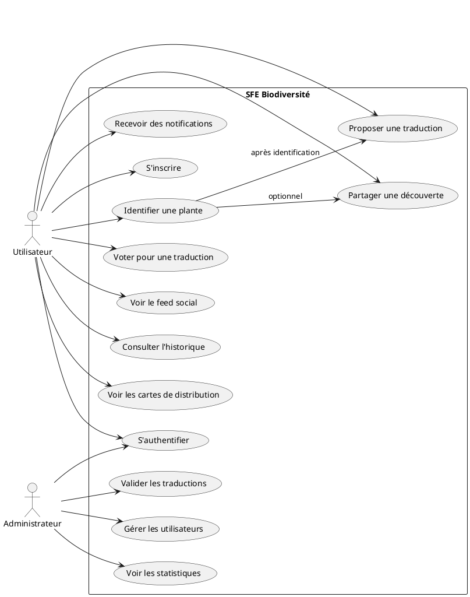

## 2. Diagramme de Classes (Class Diagram)

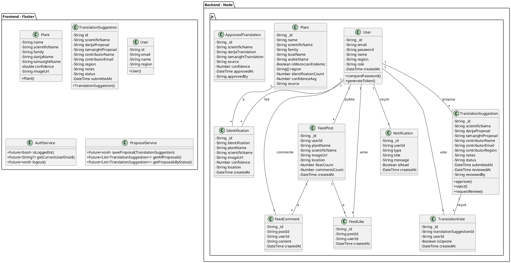

## 3. Diagramme de Séquence - Identification de Plante

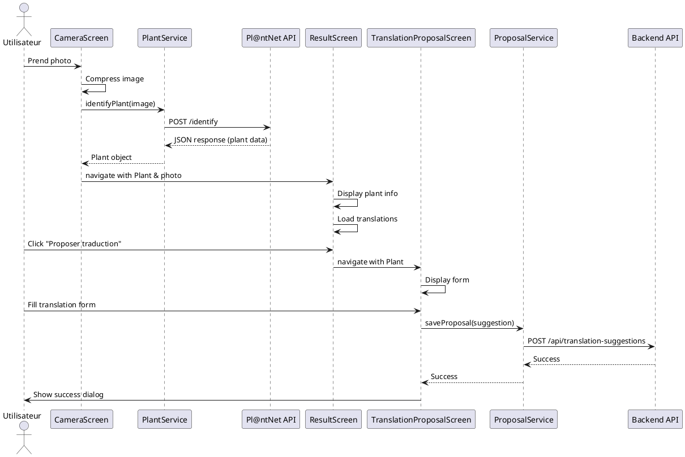

## 4. Diagramme de Séquence - Validation de Traduction

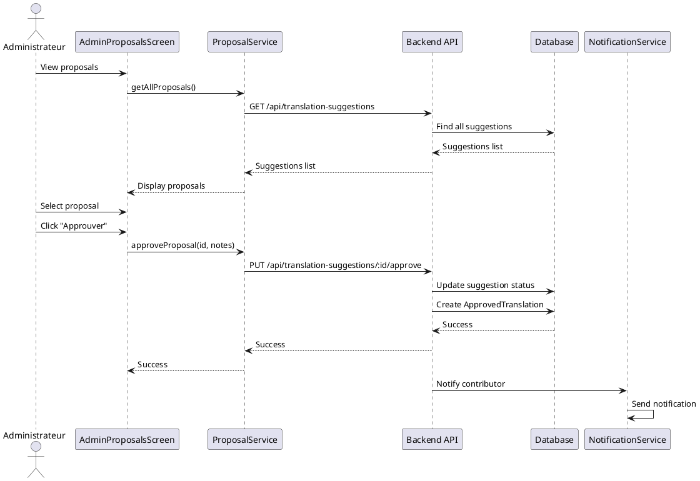

## 5. Diagramme de Composants (Component Diagram)

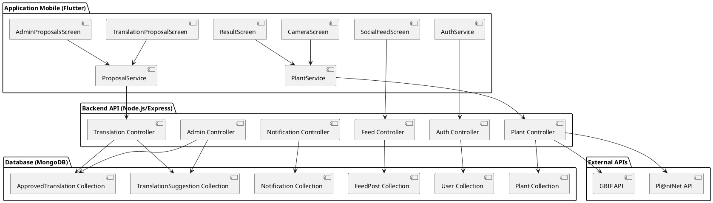

## 6. Diagramme d'Activité - Soumission de Traduction

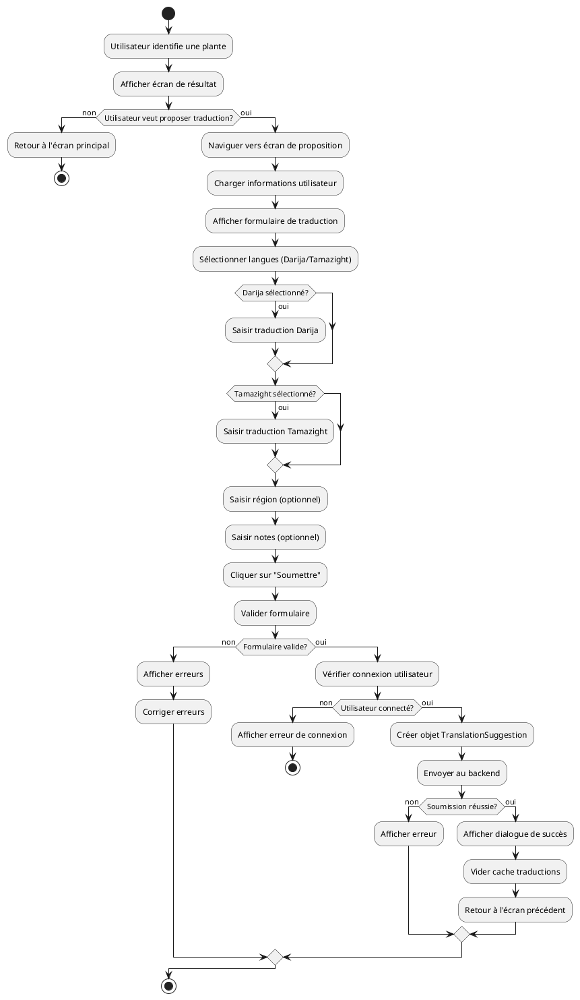

## 7. Diagramme de Déploiement (Deployment Diagram)

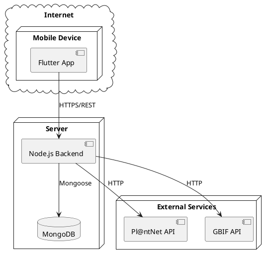

## 8. Diagramme d'État - Suggestion de Traduction

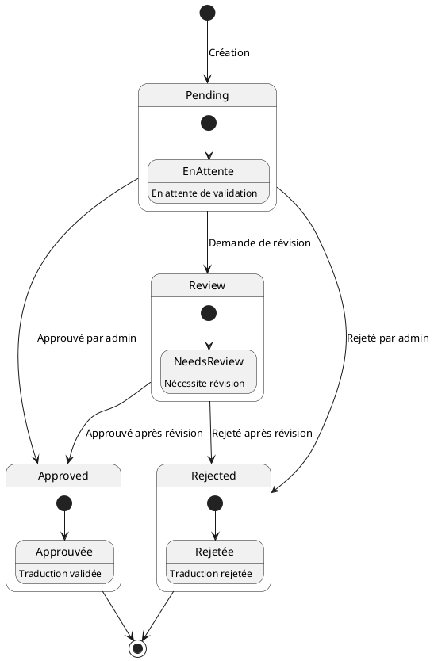

## 9. Diagramme de Séquence - Authentification

```plantuml
@startuml
actor "Utilisateur" as User
participant "LoginScreen" as Login
participant "AuthService" as Auth
participant "Backend API" as Backend
participant "Database" as DB

User -> Login : Enter email & password
User -> Login : Click "Connexion"
Login -> Auth : login(email, password)
Auth -> Backend : POST /api/auth/login
Backend -> DB : Find user by email
DB --> Backend : User document
Backend -> Backend : Compare password (bcrypt)
if (Password correct?) then (non)
  Backend --> Auth : Error (401)
  Auth --> Login : Error
  Login -> User : Show error message
else (oui)
  Backend -> Backend : Generate JWT token
  Backend --> Auth : Token + User data
  Auth -> Auth : Store token securely
  Auth --> Login : Success
  Login -> User : Navigate to Home
endif
@enduml
```

## 10. Diagramme de Packages - Architecture Frontend

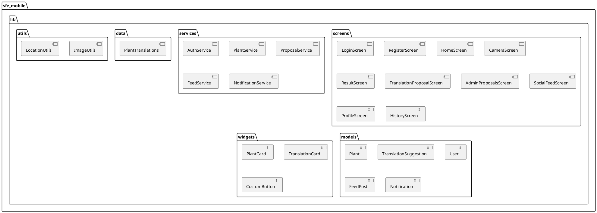

## 11. Diagramme de Séquence Simplifié - Identification de Plante (avec Pl@ntNet)

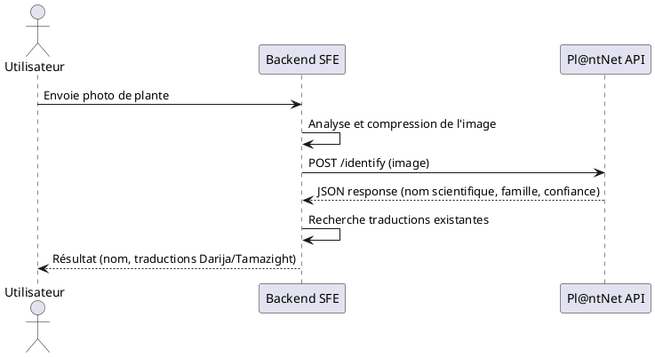

## 12. Diagramme de Séquence Simplifié - Recherche Données Scientifiques (avec GBIF)

```plantuml
@startuml
actor "Utilisateur" as User
participant "Backend SFE" as Backend
participant "GBIF API" as GBIF

User -> Backend : Demande informations scientifiques sur plante
Backend -> Backend : Vérifie cache local
if (Données en cache?) then (oui)
  Backend --> User : Retourne données du cache
else (non)
  Backend -> GBIF : GET /species (nom scientifique)
  GBIF --> Backend : JSON response (distribution, taxonomie)
  Backend -> Backend : Stocke dans cache
  Backend --> User : Retourne données GBIF
endif
@enduml
```

## 13. Diagramme de Séquence Simplifié - Soumission de Traduction

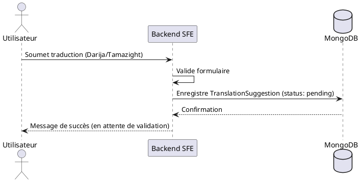

## 14. Diagramme de Séquence Simplifié - Validation de Traduction

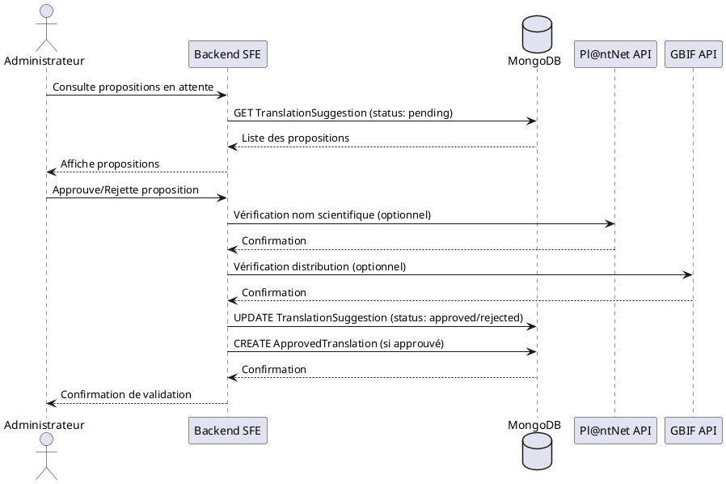

## 15. Diagramme de Séquence Simplifié - Workflow Complet Identification

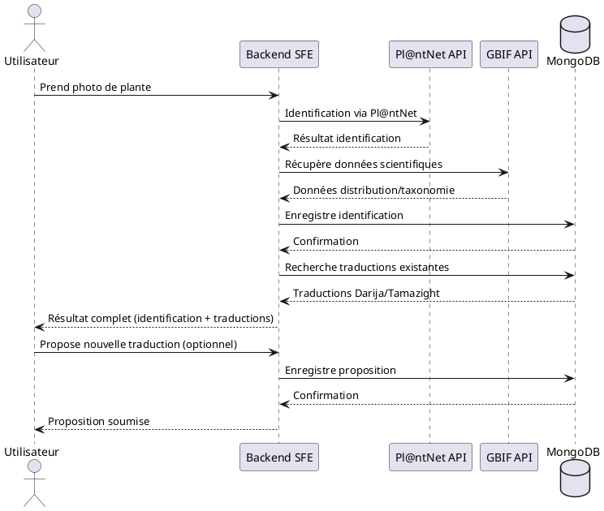

## Instructions pour visualiser les diagrammes

Pour visualiser ces diagrammes PlantUML, vous pouvez:

1. **Utiliser un éditeur en ligne**: 
   - Aller sur https://plantuml.com/online
   - Copier-coller le code de chaque diagramme

2. **Utiliser VS Code**:
   - Installer l'extension "PlantUML"
   - Ouvrir un fichier .puml ou .md avec du code PlantUML
   - Prévisualiser avec Ctrl+D (ou Cmd+D sur Mac)

3. **Utiliser IntelliJ IDEA**:
   - Installer le plugin "PlantUML integration"
   - Ouvrir un fichier .puml
   - Clic droit -> "Show PlantUML Diagram"

4. **Générer des images**:
   ```bash
   # Installer PlantUML
   # Télécharger depuis https://plantuml.com/download
   java -jar plantuml.jar diagramme.puml
   ```
